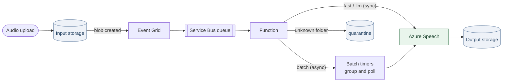

# Ingestion Client v2


Drop an audio file into a folder, get a transcript back in another storage account.
It's an event-driven pipeline on Azure Functions that runs the three current Azure
Speech engines - fast, batch, and LLM Speech - from a single deployment. The engine is
picked by the folder you upload to, so there's no redeploy or config switch to change it.

This is a Python rewrite of the older [ingestion-client](https://github.com/Azure-Samples/cognitive-services-speech-sdk/tree/master/samples/ingestion/ingestion-client)
sample, keyless throughout and using the batch API's multi-file jobs.

[](https://codespaces.new/stephenadam5/ingestion-client-v2)
[](https://vscode.dev/redirect?url=vscode%3A%2F%2Fms-vscode-remote.remote-containers%2FcloneInVolume%3Furl%3Dhttps%3A%2F%2Fgithub.com%2Fstephenadam5%2Fingestion-client-v2)

## How it works

Upload a file to `audio-input/<engine>/` and it's transcribed by that engine. Output
mirrors the input path under `transcriptions/`. All three engines run side by side:

| Folder | Engine | Good for | Capabilities |
|--------|--------|----------|--------------|
| `audio-input/fast/`  | Fast transcription (sync)   | Quick jobs, under 500 MB / 5 hr   | Diarization, phrase lists |
| `audio-input/batch/` | Batch transcription (async) | Large volumes and long audio      | Diarization, language ID, custom models |
| `audio-input/llm/`   | LLM Speech                  | Highest quality, custom prompting | Diarization, translation, prompting |

Files uploaded to an unrecognised folder (or the container root) are moved to `quarantine`.

## Architecture



- Two data storage accounts, one for audio in and one for results out, plus a small
  account for the Functions runtime.
- One Foundry (AI Services) resource serves all three Speech engines.
- No keys anywhere: a user-assigned managed identity with RBAC, and shared-key and local
  auth turned off.
- Application Insights, Log Analytics, and an Azure Monitor workbook for monitoring.

## Prerequisites

- Azure subscription + `az login`
- [Azure Developer CLI (`azd`)](https://aka.ms/azd)

## Where you can deploy

`azd up` asks which region to use. The binding constraint is LLM Speech (preview), which
today runs in `centralindia`, `eastus`, `northeurope`, `southeastasia`, `westus`, and
`westus2`. Pick one of those that also offers Azure Functions Flex Consumption - for
example `eastus`, `northeurope`, or `westus2`.

Current region lists:

- [Azure AI Speech regions](https://learn.microsoft.com/azure/ai-services/speech-service/regions?tabs=llmspeech) (LLM Speech tab)
- [Azure Functions Flex Consumption regions](https://learn.microsoft.com/azure/azure-functions/flex-consumption-how-to#view-currently-supported-regions)

If you deploy to a region without LLM Speech, drop the `llm` folder and run with just fast
and batch.

## Deploy

From your machine, or a Codespace opened with the badge above:

```pwsh
azd up
```

That's the whole deployment. `azd up` asks for an environment name and region, then
provisions everything and publishes the function in one step. The engine config files are
uploaded for you as part of it, so the pipeline is ready to use the moment it finishes.

If the first run stops with an Event Grid error about a managed identity not being
authorised to deliver to the endpoint, run `azd up` again. Azure occasionally validates
the event subscription before the role assignment that lets Event Grid write to Service
Bus has finished propagating. The second run continues from where it left off once that
permission is live.

## Use

Upload an audio file into the folder for the engine you want:

- `audio-input/fast/` for quick, synchronous transcription
- `audio-input/batch/` for large volumes and long recordings
- `audio-input/llm/` for the highest quality, with optional prompting

Use whatever you already use for blob storage - the Azure portal, Storage Explorer,
`azcopy`, or your own application. The transcript comes back in the output storage account
under `transcriptions/`, mirroring the input path, so `audio-input/fast/call.wav` becomes
`transcriptions/fast/call.wav.json`. Anything dropped outside the three engine folders
goes to `quarantine` with a short note explaining why.


## Configuring the engines (optional)

Each engine reads a settings file from the `config` container of the input storage
account: `config/fast.json`, `config/llm.json`, `config/batch.json`. They're uploaded for
you during deployment and the pipeline runs on sensible defaults, so you only touch them
to change something. Edits take effect within about a minute (no redeploy), and each file
references a JSON Schema, so VS Code gives you autocomplete and validation.

A file looks like this (fast shown; llm and batch add one extra block, described below):

```json
{
  "locales": ["en-US"],
  "diarization": { "enabled": false, "maxSpeakers": 4 },
  "profanityFilterMode": "Masked",
  "channels": [],
  "phraseList": []
}
```

### Shared settings

These apply to every engine:

| Setting | Values | What it does |
|---------|--------|--------------|
| `locales` | list of locale codes such as `["en-US"]`, or `[]` | Expected language of the audio. `[]` auto-detects. Two or more entries turn on language identification, and the service picks per file. |
| `diarization.enabled` | `true` / `false` | Separate and label each speaker. |
| `diarization.maxSpeakers` | `2` to `35` | Upper bound on speakers when diarization is on. |
| `profanityFilterMode` | `None`, `Masked`, `Removed`, `Tags` | How profanity appears in the transcript. |
| `channels` | e.g. `[0, 1]`, or `[]` | Transcribe stereo channels separately. `[]` treats the file as one channel. Not used together with diarization. |

### fast

Adds a phrase list on top of the shared settings.

| Setting | Values | What it does |
|---------|--------|--------------|
| `phraseList` | list of strings | Bias recognition toward names or jargon, e.g. `["Contoso", "AKS"]`. |

### llm

Adds an `llm` block. LLM Speech is multilingual, so leaving `locales` as `[]` is usually best.

| Setting | Values | What it does |
|---------|--------|--------------|
| `llm.task` | `transcribe`, `translate` | Transcribe in the spoken language, or translate to `targetLanguage`. |
| `llm.targetLanguage` | language code such as `en`, `es`, `fr` | Target language for `translate`. Ignored when transcribing. |
| `llm.prompt` | list of strings | Steer the output, e.g. `["Write numbers as digits."]`. |

### batch

Adds a `batch` block for the asynchronous engine. Batch has no phrase list; use a custom model instead.

| Setting | Values | What it does |
|---------|--------|--------------|
| `batch.timeToLiveHours` | `6` to `744` | How long the service keeps the finished job before cleaning it up. |
| `batch.wordLevelTimestamps` | `true` / `false` | Include per-word start and end times. |
| `batch.displayFormWordLevelTimestamps` | `true` / `false` | Per-word times on the punctuated display form (required for Whisper models). |
| `batch.punctuationMode` | `None`, `Dictated`, `Automatic`, `DictatedAndAutomatic` | How punctuation is added. |
| `batch.model` | a model URL, or `""` | Use a custom or Whisper model. Empty uses the latest base model. |

## Scaling

Everything is event-driven and scales per file. The Function app runs on Azure Functions
Flex Consumption and scales out on its own - up to roughly 800 files in flight at once -
then back to zero when idle.

`fast` and `llm` are synchronous, so each file occupies a worker while the Speech service
transcribes it. `batch` is asynchronous: a timer groups pending files and submits them as
one job with many files, so a large upload becomes a handful of API calls instead of one
per file.

The practical ceiling is the Foundry Speech resource rather than the pipeline. A single
resource allows roughly 600 fast requests per minute (you can request an increase) and a
fixed 600 per minute for LLM Speech. When traffic goes over that, the Speech service
throttles; the function honours the retry hints and the Service Bus queue holds the
backlog, so throughput settles at the quota instead of failing. To go further, run the
Speech resource in more than one region and route uploads across them - processing is
stateless per file, so it's mainly a routing change.

If a file still can't be processed after its retries are exhausted, it's recorded as an
error rather than lost, with the dead-letter queue as a final safety net.

## Notes

- Transcripts keep each engine's native JSON shape (fast and llm use `combinedPhrases`,
  batch uses `combinedRecognizedPhrases`).
- Storage lifecycle (auto-tier and expiry of old audio) is a Bicep toggle, off by default.
- `enableNetworkIsolation` locks down public network access; a production rollout should
  pair it with private endpoints and VNet integration for the Function, which aren't
  included yet.

## Future work

- MAI-Transcribe model selection. The `llm` engine runs on the default LLM Speech model
  today. The MAI-Transcribe-1 and MAI-Transcribe-1.5 models are still in preview; when
  they reach general availability, the `llm` config will get a `model` setting to choose
  between them, matching the model picker the Speech playground already exposes.

## Clean up

```pwsh
azd down --purge
```

Removes every resource this template created.

## License

Licensed under the [MIT License](LICENSE).
